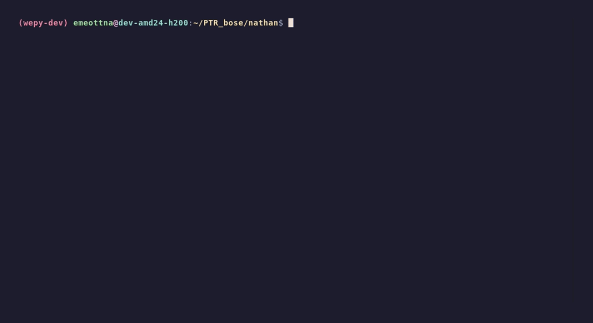

# Wepy Development Environments

Below are steps for setting up development environments for Wepy on the HPCC and locally.

## HPCC Development

### Conda Setup


1. Join a dev node on the HPCC.

```bash
# CPU only
ssh dev-amd24

# CPU and GPU
ssh dev-amd24-h200
```

2. Enter your directory on the HPCC.

```bash
cd /mnt/research/PTR_bose/your_name
```

3. Load the required modules.

```bash
ml purge && ml load Miniforge3 OpenBLAS CUDA
```

4. Create and activate the Conda environment from the `environment_minimal.yml` template.

```bash
conda env create -f ../environment_minimal.yml
conda activate wepy-dev
```

### Wepy Setup



1. Make sure to be on a dev node, have the required modules loaded, and have the Conda environment activated.

```bash
ssh dev-amd24-h200
ml purge && ml load Miniforge3 OpenBLAS CUDA
conda activate wepy-dev
```

2. Clone the `wepy_dev` repository and enter the directory.

```bash
git clone https://github.com/SamikBose/wepy_dev.git
cd wepy_dev
```

3. Build the Wepy package using `make`.

```bash
make build
```

4. Remove any existing Wepy packages.

```bash
pip uninstall wepy -y
```

5. Install the newly built Wepy package.

```bash
pip install dist/wepy-1.1.0-py2.py3-none-any.whl
```

### PySCF Setup

pyscf and gpu4pyscf?

## Local Development


1. Install Nix and Pixi on your local machine.

2. Clone the `wepy_dev` repository and enter the directory.

```bash
git clone https://github.com/SamikBose/wepy_dev.git
cd wepy_dev
```

3. Enter the Nix development shell.

```bash
nix develop
```

4. Enter the Pixi development shell (will automatically install dependencies).

```bash
pixi shell
```

5. Build the Wepy package using `make`.

```bash
make build
```

6. Install the newly built Wepy package.

```bash
uv pip install dist/wepy-1.1.0-py2.py3-none-any.whl
```
